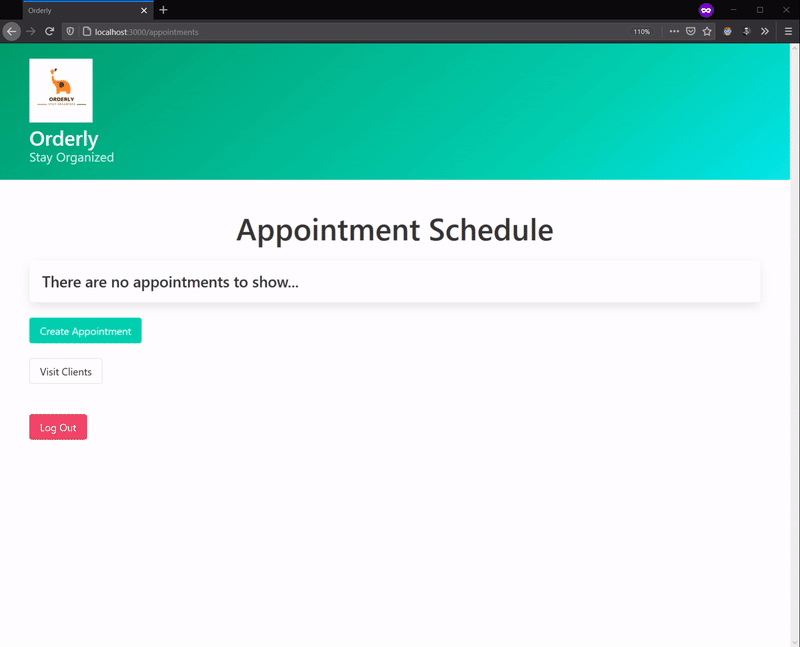

# Orderly

Orderly is a appointment planner aimed towards employees to help them schedule and organize meetings with clients in a large organization.



## Installing

1. Install dependencies

   ```bash
   bundle install
   ```

2. Seed the database

   ```bash
   rails db:migrate && rails db:seed
   ```

3. Start the server

   ```bash
   rails s
   ```

## Built with

- [Ruby](https://www.ruby-lang.org/en/)
- [Rails](https://rubyonrails.org/)
- [Bulma](https://bulma.io/)
- [Devise](https://github.com/heartcombo/devise)
- [Faker](https://github.com/faker-ruby/faker)
